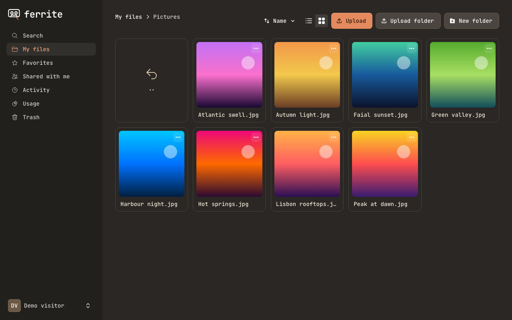
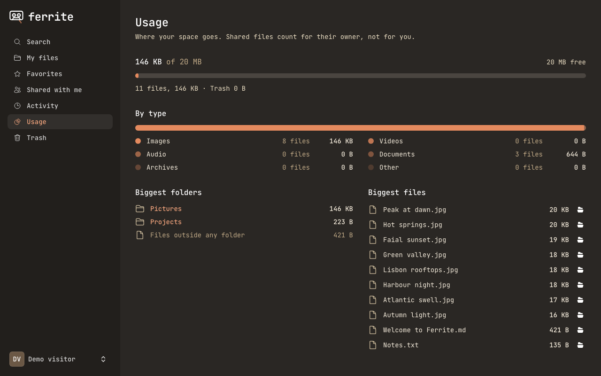
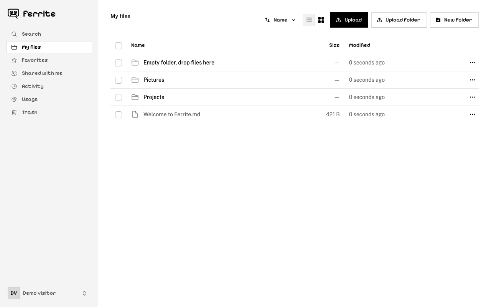
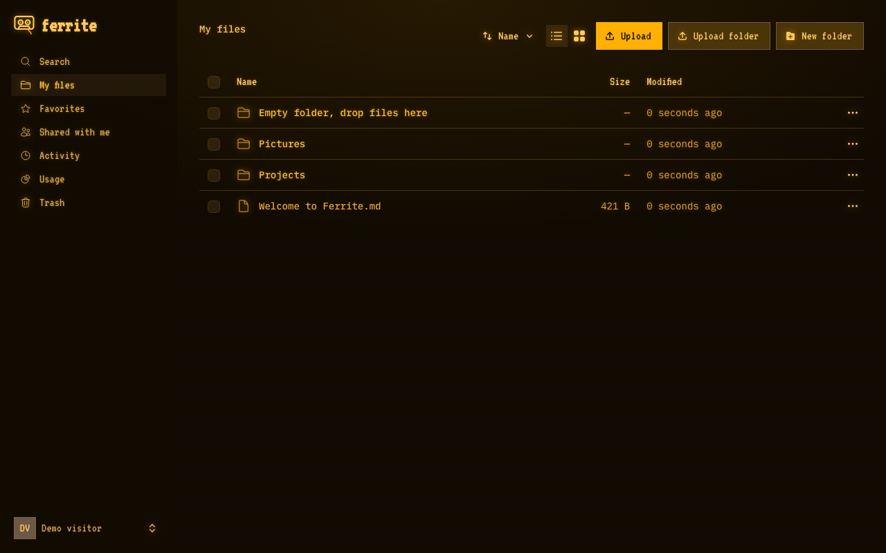
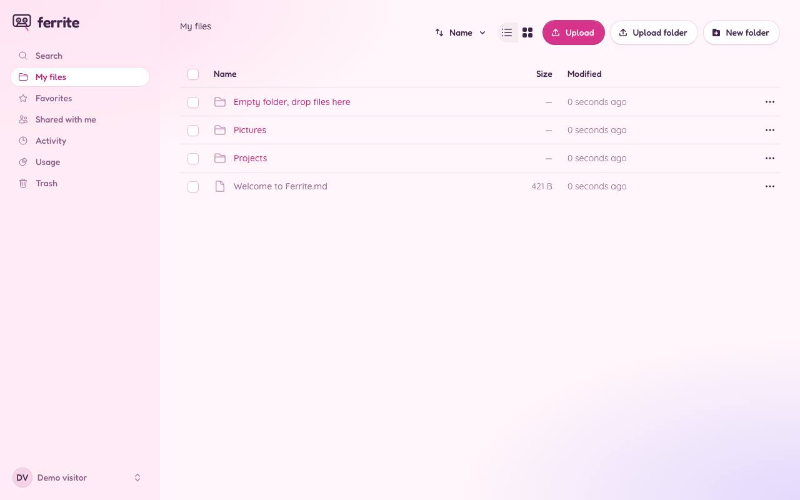

<p align="center">
  <picture>
    <source media="(prefers-color-scheme: dark)" srcset="docs/img/logo-dark.svg">
    
  </picture>
</p>

# Ferrite by StackCare

A small, self-hosted file server for one person or a small team: upload, preview and share from the browser, without the weight of a full cloud suite. For self-hosters and homelabs who want private storage on their own server. Web only, built with Laravel, Livewire and Flux. No sync clients and no WebDAV, by design.

Not to be confused with other projects of the same name, such as the Rust Markdown editor Ferrite and the Rust DNS filter ferrite-server. This one is a Laravel file-storage app, named after the magnetic coating on tape.

<p align="center">
  
</p>

## What it does

- **Files and folders** with upload (chunked and resumable, so multi-gigabyte files and flaky connections are fine; whole folders by drag and drop), download with Range support, rename, move, and folder download as ZIP.
- **Previews** for images, PDF, video, audio and text, plus image thumbnails.
- **Trash** with restore, permanent delete and automatic purge.
- **Sharing**: with other users (view or edit) and with **links** (optional password and expiry, view-only, revoke).
- **Several users** with quotas, an admin screen, two-factor authentication and passkeys.
- **Storage disks**: local folder, S3-compatible or SFTP, switchable per instance. New uploads go to the default disk.
- **Search** by name and an **activity log**.

Not included (on purpose, for now): sync clients, WebDAV, office document previews, real-time collaboration, in-content search, versioning.

Project page: https://ferrite.stackcare.pt · Live demo: https://demo.ferrite.stackcare.pt

## Screenshots

| | |
| --- | --- |
|  |  |
| The usage page: where your space goes. | Thirteen themes, picked per user. Here: Classic Mac. |
|  |  |
| Amber terminal. | Bubblegum 98. |

Try it without installing anything: https://demo.ferrite.stackcare.pt

## Install

Two ways: Docker (below) or a standard Laravel install on a server that already runs PHP and nginx or Apache ([docs/install.md](docs/install.md#without-docker-standard-laravel-install): PHP 8.3+, Composer, a queue worker and a cron entry).

### With Docker

You need a server with Docker and a domain name pointing at it.

```sh
git clone <this repository> ferrite && cd ferrite
cp docker/ferrite.env.example ferrite.env
docker compose run --rm ferrite php artisan key:generate --show   # copy the output into APP_KEY in ferrite.env
$EDITOR ferrite.env                                               # set APP_KEY and APP_URL at least
docker compose up -d
```

This pulls the prebuilt image (`ghcr.io/zhoorta/ferrite`, amd64 and arm64). Until a release exists, or to build from your checkout, use `docker compose up -d --build`.

Put a reverse proxy with HTTPS in front of port 8080 (examples in [docs/install.md](docs/install.md)), open your `APP_URL`: a fresh install shows a **Welcome** page where you create the administrator account, and registration closes afterwards. Do this right after the first start, since whoever opens the page first becomes the admin. Add everyone else under **Users**. To create or recover accounts from the command line instead:

```sh
docker compose exec ferrite php artisan ferrite:user you@example.com --admin
```

Everything that changes lives in one volume, `/data`. Back it up, and keep `APP_KEY` safe: see [docs/install.md](docs/install.md) for backups, upgrades and configuration.

## Develop

Contributions are welcome; read [CONTRIBUTING.md](CONTRIBUTING.md) first.


```sh
composer install && npm ci
cp .env.example .env && php artisan key:generate
php artisan migrate
composer dev            # or: php artisan serve, and npm run dev
php artisan test --compact
vendor/bin/pint && vendor/bin/phpstan analyse
```

`PLAN.md` has the scope and status, and `docs/` has the design notes:

| | |
| --- | --- |
| [docs/install.md](docs/install.md) | Install (Docker or standard Laravel), configuration, reverse proxy, backup, upgrade |
| [docs/uploads.md](docs/uploads.md) | The chunked upload protocol |
| [docs/serving-files.md](docs/serving-files.md) | How files are served safely |
| [docs/sharing.md](docs/sharing.md) | Sharing with users and links |
| [docs/storage-search-activity.md](docs/storage-search-activity.md) | Disks, search, activity log |
| [docs/users.md](docs/users.md) | Accounts, registration, trash |
| [docs/security.md](docs/security.md) | Security review: what was checked, known limits |
| [docs/public-site.md](docs/public-site.md) | Project page and demo mode (how ferrite.stackcare.pt runs) |

## Security

Ferrite serves files uploaded by users from its own origin, so read [docs/security.md](docs/security.md) before exposing an instance to people you do not trust. Report vulnerabilities privately (see [SECURITY.md](SECURITY.md)) rather than in a public issue.

## Licence

Ferrite is free software under the [GNU Affero General Public License v3.0](LICENSE) or later. If you run a modified version as a service for others, you must offer them its source.
